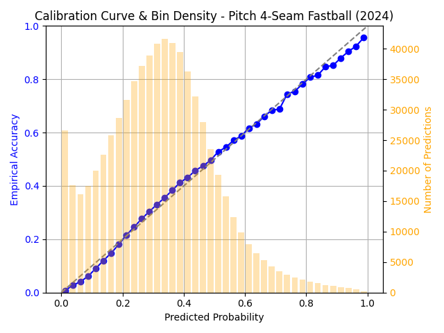
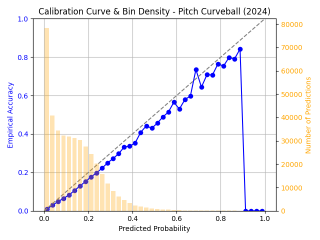
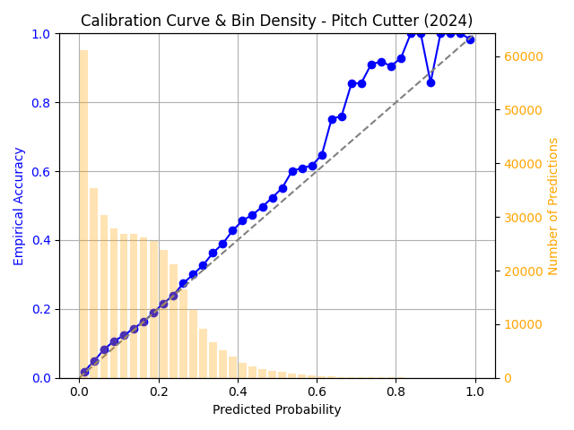
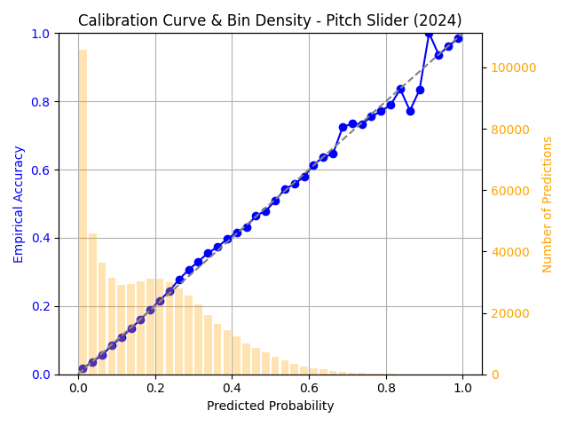
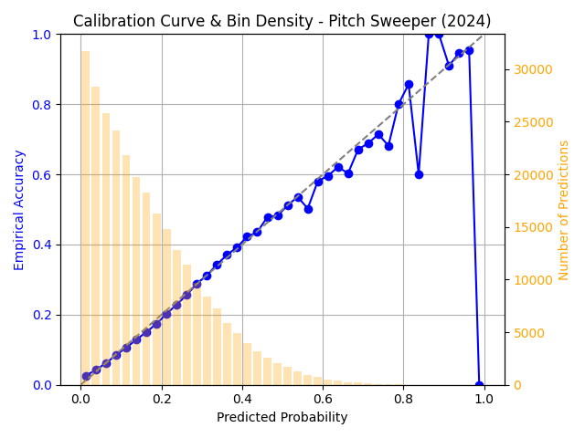
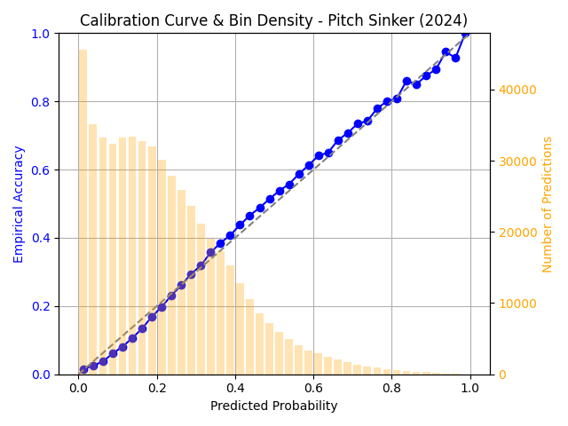

# MLB Simulation Project

The initial purpose of this project was to determine the feasibility of simulating entire MLB games in a modular fashion using machine learning techniques. The first phase of this was my pitch type model with the goal of demonstrating potential simulation level fidelity with the potential to chain together similar models to create a modular simulation of an entire mlb game and potentially entire mlb seasons. This project builds on top of the database design I did for historical MLB data and uses data ingestion pipelines made possible by that project which can be found at <https://github.com/johnbros/mlb>.

## Approach

For about 2 weeks following the 'completion' of my database I read a lot of the literature about different predictive methods that have been applied to baseball and the problems they aim to solve, and although the goal of my project was a bit different than existing literature there is a lot of good ideas that I did reuse when I finally started to implement my model. There is a few planned stages, completed currently is the pitch type model to see iterations and process of that can be found under pitch_type_model/README.md + pitch_type_model/cold_start/README.md. For a brief overview, the model I used was a LSTM neural network and evaluated the model based on it's calibration vs actual distributions. For example, in situations where the model says 40% fastball do we actually see 40% fastball.

## Results

Below is some of the calibration curves I plotted from the cold start model. I called it cold start because all player embeddings start as a randomly initialized vector and at a later point I wanted to start them in informed states so that they are just being fine tuned and the model can come to convergence easier. The curves over the withheld 2024 test season had quite good results which showed me that over an entire future season it was quite good at predicting general trends. When the problem was focused onto specific 'known' players performance did slightly suffer but not by much and I saw similar results. Unknown players remained the issue even though I was masking out pitch types we knew the pitcher wouldn't throw the distribution they were thrown just hadn't been learned and it couldn't always generalize well. When tested within the same season(trained first half test second half) the model generalized rookie pitchers much better than when I withheld the entire season. Even better performance was actually when I would train on a 2 weeks then test on the third then continue to train and test in that process the withheld testing results were quite promising.

## Whats next?

The next steps are interesting cause theres a few different directions, I would like to explore the rookie pitcher generalization because it's a challenging problem. I also would like to look into how weather impacts pitcher decision making but in all honesty the results of this model would theoretically be good enough to proceed onto a secondary model in the chain such as pitch location and start to experiment with that and that could also be a interesting avenue to work on some new aspect of the game. Theres some computer vision work that could be done with pose estimation and location drift to try and pick up on pitcher fatigue and maybe detecting manager pulling patterns. There is so much strategy involved in baseball and everything happens in a slightly different way that there really is a ton of possibilities for machine learning analysis in this sport.
